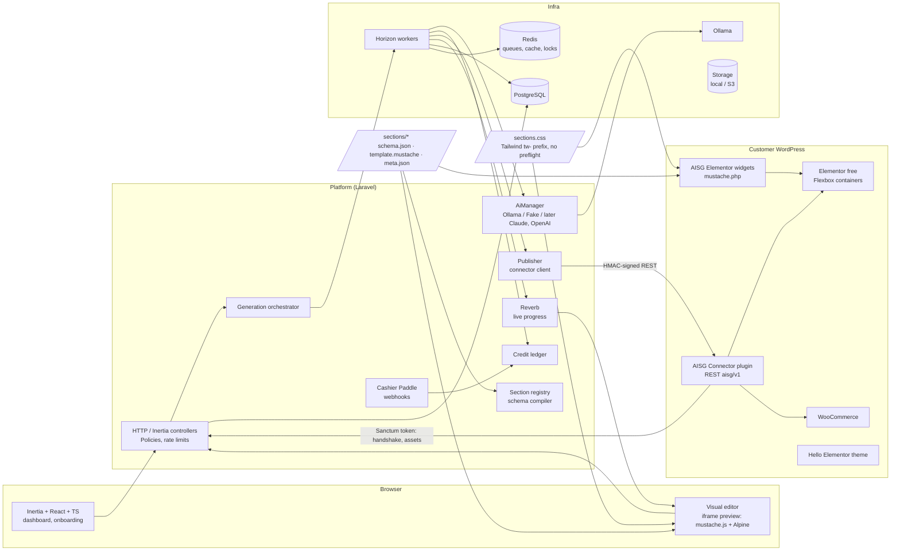
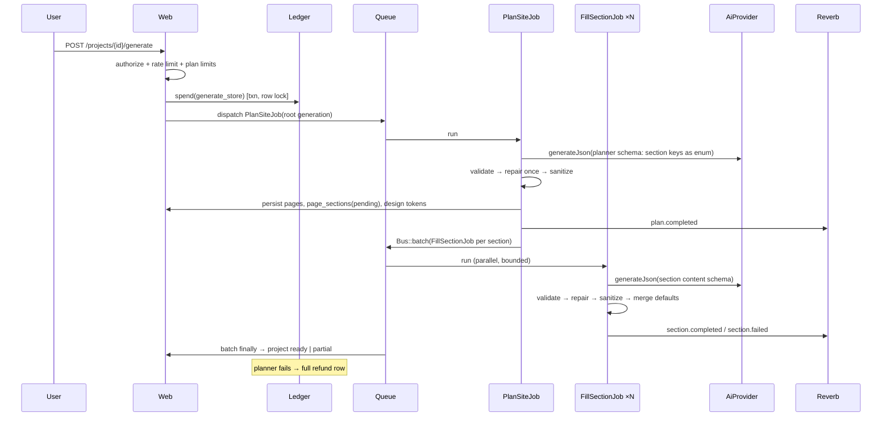

# Phase 1 — Architecture

> Status: **APPROVED 2026-09-24** (all §9 defaults accepted).
> Scope source of truth: [`saas-build-prompt.md`](../saas-build-prompt.md). Anything here that goes beyond the spec is marked **[proposal]** and listed again in §9 (Open questions).

## Decision log (changes since approval)

| Date | Milestone | Decision |
|---|---|---|
| 2026-09-24 | M1 | Built on the official Laravel React starter kit (teams variant): Laravel 13, Inertia 3, React 19, Fortify auth (2FA, passkeys), Wayfinder route helpers. |
| 2026-09-24 | M1 | Team roles come from the kit: **owner / admin / member** (replaces owner/admin/editor in §2.1/Q14). Members can create and edit projects; deleting a project needs admin or owner. The membership table is `team_members`; team URLs are slug-scoped (`/{team}/projects/...`). |
| 2026-09-24 | M1 | Domain code lives under `App\Domain\*` (not `Aisg\Domain`). Credit balance cached on `teams.credit_balance`. |
| 2026-09-24 | M1 | Q11 answered by the dev hardware (RTX 3050 Ti, 4 GB VRAM): default models `qwen3:4b` (planner, copy) and `qwen2.5vl:3b` (vision). To be re-benchmarked in M2. |
| 2026-09-24 | M1 | Pinned WP stack: WordPress 7.1.2, Elementor 4.3.1, WooCommerce 11.1.2, Hello Elementor 3.5.1 (see COMPATIBILITY.md). |
| 2026-09-24 | M2 | The shared PHP section kit lives in `packages/renderer-php` (namespace `AisgSections`, PHP 8.1-compatible) and is installed in the platform as a Composer path package. Docker mounts the whole repo at `/var/www/aisg` so relative paths match the host. |
| 2026-09-24 | M2 | Section styles: Tailwind **v3.4** with the `tw-` prefix, preflight off, `important: '.aisg'`. Dynamic classes are forbidden in templates; they use `{{#style.x_is_y}}` flags instead, so no safelist is needed. Icons are CSS masks (`aisg-icon--{name}`). Colours and fonts read Elementor's `--e-global-*` variables. |
| 2026-09-24 | M2 | The planner's pages are home/about/contact/faq (3–5 pages). Header/footer are layout parts (`pages.kind`). Design tokens are normalised for contrast (text ≥ 7:1) and brand colours always win. |
| 2026-09-24 | M2 | Reverb 1.x requires Guzzle 7, so Composer downgraded Guzzle 8 → 7 (Laravel 13 supports both). Reverb's host port is 8090 (8080 was taken on the dev machine). Polling every 4 s is the fallback. |
| 2026-09-24 | M2 | Reliability limits for small local models: `num_ctx` 4096, planner capped at 1200 tokens / 150 s, section writer at 800 tokens / 90 s, and timeouts are never retried. Measured on the RTX 3050 Ti: full store ≈ 2–4 min, 7 AI calls. |
| 2026-09-24 | M2 | Until the product catalog exists (M4), product sections preview with placeholder products. AI-generated sample products (§9 Q7) move to M4 together with the products table. |
| 2026-09-24 | M3 | Dev performance (Windows): `vendor/` moved to a Docker volume, OPcache revalidates once per second, Vite pre-warms pages and pre-bundles dependencies, and Inertia SSR is off. Pages went from ~9 s to ~0.1–0.3 s. |
| 2026-09-24 | M3 | Section library complete: 19 sections (5 layout/content + 8 store + 6 product-landing; landing FAQ reuses `faq`). Sections with example claims (testimonials, reviews, guarantee, comparison) are flagged `review_required`. The AI never writes customer names or ratings. |
| 2026-09-24 | M3 | `packages/renderer-js` (TS) mirrors the PHP kit. `RendererParityTest` renders every section in PHP and Node (defaults + hostile content) and requires byte-identical HTML. The view model gains `_even` for alternating rows. |
| 2026-09-24 | M3 | Editor saves are granular: `PATCH section` with per-section optimistic lock (`lock_version`, 409 on conflict), plus separate add/remove/reorder/rename/design endpoints. `ConvertEmptyStringsToNull` and `TrimStrings` are disabled for editor JSON. The preview is a sandboxed `srcdoc` iframe (no same-origin) talking over `postMessage`. |
| 2026-09-24 | M3 | Versions: snapshot after generation, before an AI rewrite, before a restore, throttled autosave (10 min), and named manual saves. The newest 50 unnamed versions are kept; named ones forever. A restore keeps page/section ids (stable publish refs). |
| 2026-09-24 | M3 | Image upload (JPG/PNG/WebP/GIF ≤ 5 MB, validated by content) into the `assets` table on the public disk. Product/category pickers wait for the catalog (M4). |
| 2026-09-24 | M4 | Catalog: `products` / `product_categories` (ULID refs). Sources: manual entry, WooCommerce CSV import (simple + variable with variations, "A > B" category paths; idempotent by SKU), or AI sample catalog (drafts, `source=ai`) generated with the store when it has no products. Previews switch from sample data to the real catalog automatically. |
| 2026-09-24 | M4 | Connector auth as designed (§7.3): Sanctum key (`WpConnection` is the tokenable and `Authenticatable`; `tokenable_id` is a string column) + HMAC signing with an encrypted per-connection secret. Signed route = the REST route, called through `?rest_route=`, so it works with any permalink setting. |
| 2026-09-24 | M4 | Plugin: one generic `SectionWidget` class registered per section (`$args['section_key']`, the same pattern Elementor's WordPress-widget bridge uses); controls generated from `schema.json`; content ↔ settings mapping in `ContentMapper` (links stored as `aisg:page:{slug}` / `aisg:system:{name}`, resolved at render). Saved through Elementor's Documents API. Verified in the Elementor 4.3.1 editor. |
| 2026-09-24 | M4 | Header/footer without Pro: `elementor_library` templates printed on `wp_body_open` / `get_footer` with Hello Elementor's `hello_elementor_header_footer` filter off. Tokens → active Elementor kit (system colours/typography + `aisg*` custom colours) plus a `:root` fallback for non-Elementor pages (shop, cart). |
| 2026-09-24 | M4 | Re-publish conflict detection: the plugin stores md5 of `_elementor_data` after each publish; a changed hash → 409 → logged as "skipped" unless "overwrite". Pages removed on the platform are moved to the trash (`DELETE /pages/{ref}`), not deleted. |
| 2026-09-24 | M4 | Media sideload allows the connected platform host through WordPress's private-network guard (`http_request_host_is_external`), only for our download. Category refs are looked up with SQL on termmeta because WooCommerce rewrites `get_terms()` meta queries on `product_cat`. |
| 2026-09-24 | M4 | Plugin dependencies are **not yet namespace-prefixed** (Strauss, risk R9): mustache.php could clash with another plugin shipping it. To do before public release. |

Working name used in code: **AISG** (AI Store Generator) — namespace `Aisg`, WP plugin slug `aisg-connector`, CSS prefix `tw-`, CSS variable prefix `--aisg-`. Rename is a find/replace if you have a product name.

---

## 1. Architecture overview

### 1.1 Components



| Component | Responsibility |
|---|---|
| **Platform web (Laravel + Inertia/React)** | Auth, teams, projects, onboarding, editor, billing UI, usage dashboard. |
| **Horizon workers** | Every AI call, CSV import, design import, publish and ZIP build runs in a queued job. Nothing slow runs in a request. |
| **AiManager** | Laravel `Manager` resolving the `AiProvider` driver from config. Business code only depends on the interface. |
| **StructuredGenerator** | Sits *above* the driver: builds the prompt, calls `generateJson`, validates, repairs once, sanitizes, logs to `generations`. Drivers stay dumb. |
| **Section registry** | Reads `/sections/*`, validates each package against a meta-schema, compiles `schema.json` into: AI JSON Schema, Laravel validation rules, editor form spec, Elementor control spec. Synced to `section_types`. |
| **Credit ledger** | Append-only `credit_transactions` + a locked cached balance. Spend / refund / grant are the only write paths. |
| **Publisher** | Turns the project into a **target-neutral publish package** and pushes it item by item to the connector. |
| **Reverb** | Private channel `projects.{id}` broadcasts generation/publish progress. Polling endpoint as fallback. |
| **Connector plugin** | Receives the neutral package, converts it to `_elementor_data` (containers + our widgets), upserts WooCommerce products/categories, menus, homepage, clears the Elementor CSS cache. |
| **AISG Elementor widgets** | One widget per section type, controls generated from `schema.json`, rendered with the *same* Mustache template and CSS as the editor preview. |

### 1.2 Key design decisions

1. **Target-neutral publish package; Elementor logic lives in the plugin.** The platform never builds `_elementor_data`. It sends "page → ordered sections → content JSON". The plugin (which knows the installed Elementor version) builds the container tree. A future Shopify renderer is then just another consumer of the same package, and the ZIP export *is* that package on disk.
2. **One renderer contract, two runtimes.** A spec'd *view-model builder* (§4.4) is implemented in TS and PHP and checked by a cross-runtime parity test suite (same fixtures → byte-identical HTML after normalization).
3. **AI output is data, never markup.** AI fills JSON that matches a schema compiled from `schema.json`. Templates, classes and CSS are ours. Content fields are always rendered escaped (`{{ }}`). `{{{ }}}` is allowed only for an allowlist of resolver-provided WooCommerce fields (e.g. `price_html`), enforced by a template linter at build time.
4. **Planner/filler split.** One small call produces structure (pages, section keys, a one-line brief per section, design tokens). Then one call per section fills content. That keeps prompts small for local models.
5. **Charge per user action, not per model call.** Credits are deducted once when the action starts, inside a DB transaction, and refunded by a compensating ledger row on failure.

### 1.3 Main data flows

**Generation (full store)**



**Publish**

```
PublishProjectJob
 1. health check (versions, plugin version compatibility)
 2. snapshot project_version (reason = pre_publish)
 3. build publish package (neutral JSON + asset URLs)
 4. push in dependency order, one publish_log row per item:
    design tokens → media (lazy) → categories → products → header/footer →
    pages (internal links + product refs resolved by the plugin) → menus → homepage → cache clear
 5. store remote ids + content hashes in wp_remote_mappings
 6. status = succeeded | partial | failed
```

Each step is idempotent (upsert by our stable `ref`), so a retried job or a re-publish never duplicates anything.

### 1.4 Deployment

**Dev (Docker Compose)**

| Service | Image / notes |
|---|---|
| `app` | PHP 8.3-FPM + nginx (Laravel) |
| `horizon` | same image, `php artisan horizon` |
| `reverb` | same image, `php artisan reverb:start` |
| `scheduler` | same image, `schedule:work` |
| `vite` | Node 22, Vite dev server (HMR) |
| `pgsql` | PostgreSQL 16 |
| `redis` | Redis 7 |
| `ollama` | `ollama/ollama`, model volume, optional NVIDIA GPU block; an init step pulls the configured models |
| `wp` | `wordpress:php8.2-apache` staging site, plugin bind-mounted from `apps/wp-connector` |
| `wp-db` | MySQL 8 (WordPress only) |
| `wp-init` | `wordpress:cli`: installs WP, **pinned** Elementor + WooCommerce + Hello Elementor, activates the plugin, enables the containers experiment, creates the admin user (idempotent) |
| `mailpit` | local mail catcher **[proposal]** |

Windows note (your machine): run the repo from the WSL2 filesystem for acceptable bind-mount speed. If GPU passthrough to the Ollama container is a problem, run Ollama natively on Windows and set `OLLAMA_HOST=http://host.docker.internal:11434`. Nothing else changes.

**Production [proposal, detailed in M6]:** the same app image deployed as web + horizon + reverb processes behind a load balancer, managed Postgres + Redis, S3-compatible storage, and Ollama on a GPU host (or a hosted provider once the Claude/OpenAI drivers exist).

---

## 2. Database schema

**Engine: PostgreSQL 16 [proposal].** Why:
- The core data is JSON: section content, site plans, version snapshots, generation I/O. `jsonb` is binary, compressible (TOAST), indexable with GIN, and supports partial updates (`jsonb_set`). MySQL's JSON works, but indexing it needs generated columns per path.
- Transactional DDL makes migrations safer.
- Partial indexes, e.g. "one active connection per project" or "one running generation per project".
- Row locking for the credit ledger works equally well in both, so it doesn't decide anything.
- WordPress keeps its own MySQL. The platform never touches the WP database directly, so running two engines costs nothing.

Conventions: `ulid` primary keys for anything exposed in URLs or sent to WordPress (the ULID is also the stable `ref` used for re-publish mapping). `bigint` identity keys for internal/high-volume rows (ledger, logs). All tables have `created_at`/`updated_at` unless noted. `jsonb` everywhere JSON is stored. Enums are `varchar` + CHECK constraints (easier migrations than PG enum types).

### 2.1 Identity & teams

**users** — Laravel default + extras
| column | type | notes |
|---|---|---|
| id | bigint PK | |
| name | varchar(255) | |
| email | varchar(255) | unique |
| email_verified_at | timestamptz null | |
| password | varchar(255) | |
| current_team_id | bigint null FK teams | |
| locale | varchar(10) default 'en' | UI locale |
| remember_token | varchar(100) null | |

**teams** — the billable entity **[proposal: billing per team, not per user]**
| column | type | notes |
|---|---|---|
| id | bigint PK | |
| owner_id | bigint FK users | |
| name | varchar(255) | |
| personal_team | boolean | every user gets one on signup |
| paddle_id | varchar null | Cashier customer id (Cashier `Billable` on Team) |
| credit_balance | integer default 0 | **cache only**, always updated in the same txn as a ledger row; ledger is the source of truth |
| deleted_at | timestamptz null | |
Index: `owner_id`.

**team_user**: `team_id` FK, `user_id` FK, `role` (`owner|admin|editor`), timestamps. PK (`team_id`,`user_id`). Index `user_id`.

**team_invitations**: `id`, `team_id` FK, `email`, `role`, `token` (unique, hashed), `expires_at`, `accepted_at null`. Unique (`team_id`,`email`).

**personal_access_tokens**: Sanctum default. The tokenable is `WpConnection` (see 2.5).

### 2.2 Projects & content

**projects**
| column | type | notes |
|---|---|---|
| id | ulid PK | |
| team_id | bigint FK teams | policy anchor |
| created_by | bigint FK users | |
| name | varchar(255) | store name |
| kind | varchar(20) | `store` in v1 (future: `business`) |
| status | varchar(20) | `draft|generating|ready|partial|failed` |
| creation_mode | varchar(20) | `describe|import_products|import_design` |
| language | varchar(10) | BCP-47, e.g. `ar`, `fr` |
| direction | varchar(3) | `ltr|rtl` (derived from language, overridable) |
| brief | jsonb | niche, audience, tone, style prefs, brand colors |
| site_plan | jsonb null | last accepted planner output (audit/debug) |
| logo_asset_id | ulid null FK assets | |
| currency | char(3) null | preview price formatting |
| revision | integer default 0 | optimistic concurrency for editor saves |
| deleted_at | timestamptz null | |
Indexes: (`team_id`, `updated_at` desc), partial (`team_id`) where `deleted_at is null`.

**design_tokens** (1:1 with project)
| column | type | notes |
|---|---|---|
| project_id | ulid PK FK | |
| colors | jsonb | `{primary, primary_contrast, secondary, accent, background, surface, text, muted, border}` hex |
| fonts | jsonb | `{heading: {family, weight}, body: {...}}` from a curated Google Fonts list (incl. Arabic-capable fonts) |
| radius | varchar(10) | `none|sm|md|lg|full` |
| spacing | varchar(10) | `compact|normal|airy` |
| container_width | smallint | px |
| extra | jsonb | forward-compatible |

**pages**
| column | type | notes |
|---|---|---|
| id | ulid PK | stable publish ref |
| project_id | ulid FK | |
| kind | varchar(20) | `page|header|footer` — header/footer are "layout parts", edited with the same editor **[proposal]** |
| type | varchar(30) | `home|about|contact|faq|landing|custom` (for `kind=page`) |
| title | varchar(255) | |
| slug | varchar(255) | unique per project |
| position | integer | nav order |
| is_homepage | boolean | partial unique: one per project |
| product_id | ulid null FK products | set for product landing pages |
| landing_mode | varchar(20) null | `standalone|product_layout` |
| seo | jsonb | `{title, description}` |
| deleted_at | timestamptz null | |
Indexes: (`project_id`, `kind`, `position`), unique (`project_id`, `slug`) where `deleted_at is null`.

**page_sections**
| column | type | notes |
|---|---|---|
| id | ulid PK | stable ref, becomes the Elementor container/widget id seed |
| page_id | ulid FK pages (cascade) | |
| section_key | varchar(64) FK section_types.key | |
| section_version | smallint | schema version the content was written against |
| position | integer | |
| content | jsonb | validated against the section schema |
| style | jsonb | style fields (variant, background, alignment…) |
| brief | text null | planner's one-line intent, reused on regenerate |
| status | varchar(20) | `pending|generating|ready|failed` |
| last_generation_id | ulid null FK generations | |
| lock_version | integer default 0 | per-section optimistic lock |
Indexes: (`page_id`, `position`), (`section_key`).

**section_types** — synced from `/sections` by `php artisan sections:sync`; never edited in the DB
| column | type | notes |
|---|---|---|
| key | varchar(64) PK | e.g. `hero-split` |
| version | smallint | |
| name | varchar(120) | |
| category | varchar(40) | `header|hero|commerce|social_proof|content|cta|footer|landing` |
| page_types | jsonb | allowed page types |
| requires_woocommerce | boolean | |
| schema | jsonb | raw `schema.json` |
| compiled | jsonb | AI schema, form spec, control spec (cache) |
| meta | jsonb | raw `meta.json` |
| template_hash | char(64) | sha256, for cache busting and parity checks |
| is_active | boolean | |
| synced_at | timestamptz | |

**project_versions**
| column | type | notes |
|---|---|---|
| id | bigint PK | |
| project_id | ulid FK | |
| number | integer | unique per project |
| reason | varchar(20) | `generation|autosave|manual|pre_regenerate|pre_publish|pre_restore` |
| label | varchar(120) null | user-named versions |
| snapshot | jsonb | full project document: tokens, pages, sections (with ids), nav |
| created_by | bigint null FK users | |
Indexes: unique (`project_id`, `number`), (`project_id`, `created_at` desc). Retention job: keep the last 50 unnamed plus all named/pre_publish **[proposal]**.

### 2.3 Catalog (local copy before publish)

**products**
| column | type | notes |
|---|---|---|
| id | ulid PK | stable ref (`_aisg_ref` meta on WC side) |
| project_id | ulid FK | |
| type | varchar(20) | `simple|variable` (v1) |
| name, slug | varchar | unique slug per project |
| sku | varchar(100) null | |
| regular_price, sale_price | numeric(12,2) null | |
| short_description, description | text | plain text / limited markdown, no HTML |
| images | jsonb | ordered `[{asset_id, alt}]` |
| attributes | jsonb | `[{name, options[], variation: bool}]` |
| variations | jsonb | `[{ref, attributes{}, sku, regular_price, sale_price, stock_status, image_asset_id}]` |
| stock_status | varchar(20) | `instock|outofstock|onbackorder` |
| stock_quantity | integer null | |
| status | varchar(20) | `draft|publish` |
| source | varchar(20) | `manual|csv|ai` |
| extra | jsonb | unmapped CSV columns kept for round-trip |
| deleted_at | timestamptz null | |
Indexes: (`project_id`, `status`), unique (`project_id`, `slug`), (`project_id`, `sku`).

**product_categories**: `id ulid`, `project_id`, `parent_id null self-FK`, `name`, `slug` (unique per project), `description`, `image_asset_id null`, `position`.
**category_product**: (`category_id`, `product_id`) PK.

**assets** (all uploaded or fetched binaries)
| column | type | notes |
|---|---|---|
| id | ulid PK | |
| team_id, project_id | FKs (project null for team-level) | |
| kind | varchar(20) | `logo|product|section|design_import|csv|export` |
| disk, path | varchar | |
| mime | varchar(100) | validated by magic bytes, not extension |
| size | bigint | |
| width, height | integer null | |
| checksum | char(64) | dedupe; also the WP-side dedupe key |
Index: (`project_id`, `kind`), (`checksum`).

**imports** (CSV and design imports)
`id ulid`, `project_id`, `type` (`products_csv|design_screenshot|design_url`), `asset_id null`, `source_url null`, `status`, `generation_id null`, `result jsonb` (row errors / extracted plan), `stats jsonb`.

### 2.4 AI & credits

**generations** — one row per AI call (a user action may spawn several; they're linked by `parent_id`)
| column | type | notes |
|---|---|---|
| id | ulid PK | |
| parent_id | ulid null self-FK | planner → section fills |
| team_id | bigint FK | |
| project_id | ulid null FK | |
| user_id | bigint null FK | |
| task | varchar(40) | `plan_site|fill_section|regenerate_section|import_design|product_description|plan_landing` |
| action_key | varchar(40) null | credit action this call belongs to (set on root only) |
| subject_type, subject_id | morph null | page_section / product / import |
| provider, model | varchar | |
| status | varchar(20) | `queued|running|succeeded|repaired|failed` |
| attempts | smallint | 1 or 2 (repair) |
| system_prompt | text | |
| prompt | text | |
| json_schema | jsonb | schema sent to the model |
| output | jsonb null | validated + sanitized result |
| raw_output | text null | exactly what the model returned (last attempt) |
| validation_errors | jsonb null | |
| tokens_in, tokens_out | integer | |
| duration_ms | integer | |
| credits | integer default 0 | credits attributed (root row holds the charged amount) |
| error | text null | |
| started_at, finished_at | timestamptz | |
Indexes: (`project_id`, `created_at` desc), (`team_id`, `created_at` desc), (`status`) partial where status in (`queued`,`running`), (`parent_id`).

**credit_transactions** — append-only ledger (no updates, no deletes)
| column | type | notes |
|---|---|---|
| id | bigint PK | |
| team_id | bigint FK | |
| user_id | bigint null FK | actor |
| type | varchar(20) | `grant|purchase|spend|refund|adjustment|expire` |
| amount | integer | signed (+grant/purchase/refund, −spend/expire) |
| balance_after | integer | CHECK ≥ 0 |
| action_key | varchar(40) null | e.g. `generate_store` |
| generation_id | ulid null FK | root generation for spend/refund |
| reference_type, reference_id | morph null | Paddle transaction, subscription period, admin |
| idempotency_key | varchar(100) unique | webhooks and job retries can't double-apply |
| meta | jsonb | |
| created_at | timestamptz | |
Indexes: (`team_id`, `created_at` desc), (`generation_id`).
Write path: `SELECT … FROM teams WHERE id = ? FOR UPDATE` → check balance → insert ledger row → update `teams.credit_balance`, all in one transaction. A nightly job re-sums the ledger and alerts on drift.

### 2.5 Publishing

**wp_connections**
| column | type | notes |
|---|---|---|
| id | ulid PK | Sanctum tokenable |
| project_id | ulid FK | partial unique: one active connection per project |
| team_id | bigint FK | |
| site_url | varchar(255) | normalized |
| status | varchar(20) | `pending|connected|error|revoked` |
| signing_secret | text | **encrypted** (Laravel `encrypted` cast); see §7.2 |
| key_last_four | char(4) | display only |
| wp_version, php_version, elementor_version, woocommerce_version, plugin_version, theme | varchar null | from last health check |
| last_health | jsonb null | full health payload |
| last_health_at | timestamptz null | |
| last_error | text null | |
| connected_at, revoked_at | timestamptz null | |

**publishes** (one row per publish run)
`id ulid`, `project_id`, `wp_connection_id null` (null = ZIP export), `project_version_id FK`, `triggered_by`, `target` (`push|zip`), `status` (`queued|running|succeeded|partial|failed`), `options jsonb` (`{force_overwrite: bool}`), `summary jsonb` (counts), `export_asset_id null`, `started_at`, `finished_at`. Index (`project_id`, `created_at` desc).

**publish_logs** (spec: "publish log with status per item")
| column | type | notes |
|---|---|---|
| id | bigint PK | |
| publish_id | ulid FK | |
| item_type | varchar(20) | `tokens|category|product|header|footer|page|menu|homepage|cache` |
| item_ref | varchar(40) null | our ulid |
| action | varchar(20) | `create|update|skip|conflict|delete` |
| status | varchar(20) | `pending|ok|failed|conflict` |
| remote_id | bigint null | WP post/term id |
| http_status | smallint null | |
| error | text null | |
| duration_ms | integer | |
Index: (`publish_id`, `id`).

**wp_remote_mappings** (what makes re-publish idempotent)
`wp_connection_id`, `local_type` (`page|header|footer|product|category|asset|menu`), `local_ref` (ulid), `remote_id` (bigint), `published_hash` (sha256 of what we sent), `remote_hash` (hash of what WP stored, for drift detection), `published_at`. Unique (`wp_connection_id`, `local_type`, `local_ref`). The plugin also writes `_aisg_ref` post/term meta, so mappings can be rebuilt from WP if this table is lost.

### 2.6 Billing

Cashier Paddle's tables are used as-is: `customers`, `subscriptions`, `subscription_items`, `transactions` (Billable = `Team`).

**plans**
`id`, `key` unique, `name`, `paddle_product_id`, `paddle_price_monthly`, `paddle_price_yearly null`, `monthly_credits` int, `limits jsonb` (`{projects, wp_connections, team_members, versions_retained}`), `is_active`, `sort`.

**credit_packs**
`id`, `key` unique, `name`, `credits`, `paddle_price_id`, `is_active`, `sort`.

Credit grants: on the Paddle `subscription.created`/`transaction.completed` (renewal) webhook → ledger `grant` row with `idempotency_key = paddle:{transaction_id}`. Pack purchase → `purchase` row. Whether monthly credits roll over is an open question (§9).

### 2.7 Relations summary

```
users ⟷ teams (team_user, role)
teams 1─* projects 1─1 design_tokens
projects 1─* pages 1─* page_sections *─1 section_types
projects 1─* products *─* product_categories
projects 1─* project_versions · assets · imports · generations
projects 1─* wp_connections 1─* publishes 1─* publish_logs
wp_connections 1─* wp_remote_mappings
teams 1─* credit_transactions *─0..1 generations
teams 1─* subscriptions (Cashier) ; plans / credit_packs are catalog tables
```

Laravel defaults are also present: `sessions`, `cache`, `jobs`, `job_batches`, `failed_jobs`, `notifications`.

---

## 3. Monorepo folder structure

```
wordpress_saas/
├── apps/
│   ├── platform/                      # Laravel app
│   │   ├── app/
│   │   │   ├── Domain/
│   │   │   │   ├── Ai/
│   │   │   │   │   ├── Contracts/AiProvider.php
│   │   │   │   │   ├── AiResult.php
│   │   │   │   │   ├── AiManager.php              # driver resolution + model routing
│   │   │   │   │   ├── Drivers/OllamaProvider.php
│   │   │   │   │   ├── Drivers/FakeAiProvider.php
│   │   │   │   │   ├── StructuredGenerator.php    # validate → repair → sanitize → log
│   │   │   │   │   ├── JsonSchemaValidator.php    # opis/json-schema wrapper
│   │   │   │   │   ├── OutputSanitizer.php
│   │   │   │   │   └── Prompts/                   # versioned prompt builders per task
│   │   │   │   ├── Credits/     (CreditLedger, CreditCosts, InsufficientCredits)
│   │   │   │   ├── Sections/    (SectionRegistry, SectionSyncCommand)
│   │   │   │   ├── Generation/  (Orchestrator, Jobs/, Events/, SitePlan DTOs)
│   │   │   │   ├── Projects/    (actions, versions, document serializer)
│   │   │   │   ├── Catalog/     (WooCsvImporter, product actions)
│   │   │   │   ├── DesignImport/
│   │   │   │   ├── Publishing/  (PackageBuilder, ConnectorClient, Jobs/, ZipExporter)
│   │   │   │   └── Billing/     (Paddle listeners, PlanLimits)
│   │   │   ├── Http/ (Controllers, Requests, Resources, Middleware)
│   │   │   ├── Policies/
│   │   │   └── Models/
│   │   ├── config/ (ai.php, credits.php, sections.php, connector.php)
│   │   ├── resources/js/
│   │   │   ├── Pages/          # Inertia pages
│   │   │   ├── Components/
│   │   │   ├── editor/         # editor state (zustand), panels, dnd, iframe bridge
│   │   │   ├── preview/        # iframe runtime: renderer + Alpine
│   │   │   └── lang/           # UI i18n (en first)
│   │   ├── database/ (migrations, factories, seeders)
│   │   └── tests/ (Pest: Unit, Feature, fixtures/ai/*.json)
│   │
│   └── wp-connector/                  # WordPress plugin (PHP 8.1+)
│       ├── aisg-connector.php
│       ├── src/                       # see §6
│       ├── assets/                    # built: sections.css, alpine.js, editor.js, frontend.js
│       ├── sections/                  # copied from /sections at build time
│       ├── vendor/                    # scoped with Strauss (no dependency clashes)
│       └── tests/
│
├── sections/                          # SINGLE SOURCE OF TRUTH for section types
│   ├── _meta-schema/                  # JSON Schemas validating schema.json & meta.json
│   ├── _fixtures/                     # shared content fixtures for parity tests
│   ├── hero-split/
│   │   ├── schema.json
│   │   ├── template.mustache
│   │   ├── meta.json
│   │   └── thumbnail.webp
│   └── …
│
├── packages/
│   ├── renderer-js/                   # TS: view-model builder + mustache.js (editor)
│   ├── renderer-php/                  # Composer: view-model builder + mustache.php
│   │                                  #   + SchemaCompiler (AI schema, rules, controls)
│   │                                  #   used by Laravel AND the WP plugin
│   ├── section-styles/                # Tailwind config, tokens.css → dist/sections.css
│   └── contracts/                     # JSON Schemas: site-plan, publish-package, section-schema
│                                      #   → generated TS types + PHP DTO validation
├── docker/
│   ├── php/ nginx/ wordpress/ (wp-init.sh, pinned versions in versions.env)
│   └── ollama/ (pull-models.sh)
├── tools/
│   ├── build-plugin.sh                # copy sections + css, scope vendor, zip
│   ├── lint-templates.ts              # unescaped-tag allowlist, class prefix check
│   └── parity/                        # JS vs PHP render comparison runner
├── docs/ (ARCHITECTURE.md, COMPATIBILITY.md, DEPLOYMENT.md)
├── docker-compose.yml
├── package.json / pnpm-workspace.yaml
└── README.md
```

---

## 4. Section system, section JSON format, site-plan format

### 4.1 `schema.json` (section field definition)

This is our own small DSL, not raw JSON Schema. It is compiled into four targets:
1. **AI JSON Schema**: only fields with `ai.generate: true`, flattened, simple keywords so Ollama's grammar can handle it.
2. **Server validation**: full constraints, used for AI output, editor saves and CSV imports.
3. **Editor form spec**: the React side panel.
4. **Elementor control spec**: the WP widget panel.

```json
{
  "$schema": "../_meta-schema/section.schema.json",
  "key": "hero-split",
  "version": 1,
  "fields": [
    { "name": "eyebrow",  "type": "text",     "label": "Eyebrow",  "default": "New collection",
      "constraints": { "maxLength": 40 },
      "ai": { "generate": true, "hint": "2–4 word label above the headline" } },

    { "name": "headline", "type": "text",     "label": "Headline", "required": true,
      "default": "Everyday essentials, done right",
      "constraints": { "minLength": 10, "maxLength": 80 },
      "ai": { "generate": true, "hint": "Benefit-led headline, no punctuation at the end" } },

    { "name": "subheadline", "type": "textarea", "label": "Subheadline",
      "constraints": { "maxLength": 200 },
      "ai": { "generate": true, "hint": "One or two sentences expanding the headline" } },

    { "name": "primary_cta", "type": "link", "label": "Primary button",
      "default": { "label": "Shop now", "target": { "kind": "system", "value": "shop" } },
      "ai": { "generate": true, "hint": "Button label only, max 3 words", "only": ["label"] } },

    { "name": "image", "type": "image", "label": "Image",
      "ai": { "generate": false } },

    { "name": "highlights", "type": "repeater", "label": "Highlights",
      "constraints": { "minItems": 0, "maxItems": 4 },
      "item_label": "{{text}}",
      "fields": [
        { "name": "icon", "type": "icon", "label": "Icon", "default": "check",
          "ai": { "generate": true, "hint": "Pick from the icon set" } },
        { "name": "text", "type": "text", "label": "Text", "constraints": { "maxLength": 40 },
          "ai": { "generate": true } }
      ] }
  ],
  "style": [
    { "name": "layout",     "type": "select", "label": "Image position", "default": "end",
      "options": [ { "value": "start", "label": "Start" }, { "value": "end", "label": "End" } ] },
    { "name": "background", "type": "select", "label": "Background", "default": "surface",
      "options": [ { "value": "background" }, { "value": "surface" }, { "value": "primary" } ] },
    { "name": "padding_y",  "type": "select", "label": "Vertical spacing", "default": "md",
      "options": [ { "value": "sm" }, { "value": "md" }, { "value": "lg" } ] }
  ],
  "data": null
}
```

**Field types (closed set):** `text`, `textarea`, `number`, `boolean`, `select`, `color` (token name or hex), `link` (`{label, target: {kind: page|system|product|url, value}}`), `image` (`{asset_id, alt}`), `icon` (from our bundled icon set), `product` (ref), `product_query` (`{source: latest|featured|category|ids|on_sale, category_ref?, ids?, limit, orderby}`), `category` (ref), `repeater`.

**Hard constraints (enforced by the meta-schema):**
- Repeaters are **one level deep** and contain only primitive fields, because Elementor's REPEATER control cannot nest.
- `ai.generate` is only allowed on `text`, `textarea`, `select`, `icon`, `number`, `boolean`, `repeater`, `link.label`. The AI never picks images, URLs, colors or products.
- Field `name` is `snake_case` and unique within its scope. It becomes the Elementor control id (`aisg_` prefixed).

**`data`** declares WooCommerce-dependent inputs:
```json
"data": { "products": { "resolver": "products", "from_field": "query" } }
```
Resolvers (`products`, `product`, `categories`, `cart`) exist in PHP (live WooCommerce) and TS (project catalog for the preview), and return the **same shape** (§4.4).

### 4.2 `meta.json`

```json
{
  "key": "hero-split",
  "name": "Hero — split image",
  "category": "hero",
  "variant_of": "hero",
  "page_types": ["home", "landing", "custom"],
  "placement": "body",
  "requires_woocommerce": false,
  "interactive": false,
  "thumbnail": "thumbnail.webp",
  "planner_description": "Large headline with supporting text and a CTA beside a single image. Good first section."
}
```
`placement`: `header|body|footer`. `planner_description` is what the planner model sees (short, so it fits small context windows).

### 4.3 `template.mustache` rules

```mustache
<section class="aisg-s tw-bg-{{style.background}} {{#style.padding_y_is_lg}}tw-py-24{{/style.padding_y_is_lg}}…"
         data-aisg-section="{{section.key}}" id="{{section.anchor}}">
  <div class="tw-mx-auto tw-max-w-[var(--aisg-container)] tw-grid md:tw-grid-cols-2 tw-gap-10">
    {{#content.eyebrow}}<p class="tw-text-sm tw-font-semibold tw-text-primary">{{content.eyebrow}}</p>{{/content.eyebrow}}
    <h1 class="tw-font-heading tw-text-4xl">{{content.headline}}</h1>
    …
  </div>
</section>
```
- Only Mustache variables, sections and inverted sections. **No lambdas, no partials, no set-delimiters** (keeps the JS and PHP output identical).
- `{{{triple}}}` only on allowlisted resolver fields (`data.*.price_html`, `data.*.rating_html`). The linter fails the build otherwise.
- Every class must start with `tw-` or `aisg-`. Dynamic class fragments must come from `select` option values, so Tailwind can safelist them (the build generates the safelist from the schemas).
- Alpine attributes (`x-data`, `@click`, `x-show`) are allowed. Alpine components are pre-registered by name (`x-data="aisgGallery"`) in our JS bundle; templates never contain inline JS expressions longer than a property access or call.
- The widget wrapper `<div class="aisg" dir="{{site.dir}}" lang="{{site.lang}}">` is emitted by the renderer, not by templates.

### 4.4 View-model contract (identical in PHP and TS)

```json
{
  "section": { "id": "01J…", "key": "hero-split", "anchor": "s-01j…" },
  "site":    { "lang": "ar", "dir": "rtl", "currency": "MAD" },
  "content": { "...": "field values, defaults applied, strings already plain text" },
  "style":   { "layout": "end", "layout_is_end": true, "padding_y": "md", "padding_y_is_md": true },
  "data":    { "products": [ { "id": 12, "ref": "01J…", "name": "…", "url": "…", "image": {…},
                               "price_html": "…", "on_sale": false, "in_stock": true,
                               "add_to_cart_url": "…", "variations_json": "…" } ] }
}
```
The builder rules are fully deterministic and written into `packages/contracts/view-model.md`:
- Defaults are applied for missing fields.
- Every `select` value `v` on field `f` adds `f_is_v: true`.
- Every repeater item gets `_index`, `_first`, `_last`.
- Empty strings and empty arrays stay falsy.
- A `link` resolves to `{label, href, is_external}`.
- An `image` resolves to `{url, alt, width, height}`.
- HTML escaping is set to the same function in both engines: `& < > " '` → entities. The defaults differ (mustache.php doesn't escape `'`, mustache.js also escapes `/ \` =`), so we override both.

### 4.5 Styles & design tokens

- **Tailwind v3.4 for the section bundle [proposal]**, with `prefix: 'tw-'`, `corePlugins.preflight: false`, and `important: '.aisg'`. Why not v4 for this bundle: v4 emits utilities inside `@layer`, and *unlayered* CSS (Elementor, WooCommerce, themes) always beats layered CSS. That would let theme rules like `.woocommerce a` override our utilities. v3's selector strategy (`.aisg .tw-…`) raises specificity just enough without `!important`. The platform's own UI can use Tailwind v4 (separate build, never shipped to WP).
- Content globs point at `sections/**/*.mustache` plus the generated safelist. The output `sections.css` is committed as a build artifact and shipped to both the editor iframe and the plugin.
- Use logical utilities only (`tw-ms-*`, `tw-ps-*`, `tw-text-start`) so RTL works through `dir="rtl"` alone. The linter rejects physical `ml/mr/pl/pr/left/right`.
- Tokens are CSS variables. Tailwind theme colors map to them:
  ```css
  .aisg {
    --aisg-color-primary: var(--e-global-color-primary, #111827);
    --aisg-color-secondary: var(--e-global-color-secondary, #6b7280);
    --aisg-color-text: var(--e-global-color-text, #111827);
    --aisg-color-accent: var(--e-global-color-accent, #f59e0b);
    --aisg-color-surface: var(--e-global-color-aisgsurface, #f9fafb);
    --aisg-font-heading: var(--e-global-typography-primary-font-family, system-ui);
    --aisg-font-body: var(--e-global-typography-text-font-family, system-ui);
    --aisg-radius: 0.5rem; --aisg-space-section: 5rem; --aisg-container: 1200px;
  }
  ```
  **In Elementor**, the plugin writes colors and fonts into the active **Kit's Global Colors / Global Fonts** (available in Elementor free). Editing them in *Site Settings* therefore restyles every AISG section. Radius, spacing and container width go into a small "AISG Design" settings screen, and each widget gets style controls that override the variables on `{{WRAPPER}}` through Elementor `selectors`.
  **In the editor preview**, the same variables are set on the iframe `:root` from `design_tokens`.

### 4.6 Initial section library

| Category | Keys (v1) | Milestone |
|---|---|---|
| Layout parts | `header-classic`, `footer-columns` | M2 (starter) |
| Hero | `hero-split`, `hero-centered`, `hero-image-bg` | M2: `hero-split`; M3: rest |
| Commerce | `product-grid`, `featured-product`, `categories-grid` | M2: `product-grid`; M3: rest |
| Content | `benefits`, `testimonials`, `faq`, `cta-banner`, `newsletter` | M2: `faq`; M3: rest |
| Landing | `lp-product-hero` (gallery + variant picker + add-to-cart), `lp-features`, `lp-comparison`, `lp-reviews`, `lp-guarantee`, `lp-sticky-atc`, `lp-faq` (a style variant of `faq` if the fields are identical) | M3 (library), wired to the landing generator in M5 |

M2's five starters: `header-classic`, `hero-split`, `product-grid`, `faq`, `footer-columns`. Together they cover every hard case: a layout part, plain content, WooCommerce data, and Alpine interactivity.

### 4.7 Site-plan JSON (planner output)

The planner schema is **generated at runtime**: `section` is an `enum` of the active section keys allowed for that page type, and font families are an `enum` of the curated list. Small models then can't invent keys.

```json
{
  "version": 1,
  "site": {
    "name": "Atlas Argan",
    "tagline": "Pure Moroccan argan care",
    "language": "ar",
    "tone": "warm"
  },
  "design": {
    "colors": { "primary": "#7c4a1e", "primary_contrast": "#ffffff", "secondary": "#e9d8c4",
                "accent": "#2f6f4f", "background": "#ffffff", "surface": "#faf6f1",
                "text": "#1f1a17", "muted": "#6b625b", "border": "#e7e1da" },
    "fonts": { "heading": "Tajawal", "body": "Tajawal" },
    "radius": "md",
    "spacing": "normal"
  },
  "layout": { "header": "header-classic", "footer": "footer-columns" },
  "pages": [
    { "type": "home", "title": "الرئيسية", "slug": "home",
      "sections": [
        { "section": "hero-split",   "brief": "Introduce pure cold-pressed argan oil for hair and skin" },
        { "section": "product-grid", "brief": "Best sellers" },
        { "section": "benefits",     "brief": "Organic, women's cooperative, fast delivery" },
        { "section": "testimonials", "brief": "Customers praising results on dry hair" },
        { "section": "faq",          "brief": "Shipping, authenticity, usage" }
      ] },
    { "type": "about",   "title": "…", "slug": "about",   "sections": [ … ] },
    { "type": "contact", "title": "…", "slug": "contact", "sections": [ … ] }
  ],
  "navigation": { "primary": ["home", "shop", "about", "contact"], "footer": ["about", "contact"] }
}
```

- Navigation items are page slugs plus system targets (`shop`, `cart`, `account`). The platform resolves them; the model never outputs URLs.
- WooCommerce system pages (shop, cart, checkout, my account) are *not* in the plan. They stay WooCommerce-rendered inside our header/footer.

**Section fill call** (per section): the input is `{site context, page title, section brief, neighbouring section keys}`. The output is exactly the compiled AI schema for that section (e.g. `{eyebrow, headline, subheadline, primary_cta: {label}, highlights: [{icon, text}]}`).

**Design import** (vision): the same planner schema is reused, restricted to one page (`home`). The prompt says: "map what you see onto these section types; describe structure and palette, not copy". The result goes through the same validation, and content is then filled by the normal fill jobs, so no third-party text or images are copied.

### 4.8 Publish package (neutral format, also the ZIP manifest)

```json
{
  "package_version": 1,
  "project": { "ref": "01J…", "name": "…", "language": "ar", "direction": "rtl" },
  "design_tokens": { "colors": { … }, "fonts": { … }, "radius": "md", "spacing": "normal", "container_width": 1200 },
  "assets": [ { "ref": "01J…", "url": "https://platform/…signed", "checksum": "…", "mime": "image/webp", "alt": "…" } ],
  "categories": [ { "ref": "…", "parent_ref": null, "name": "…", "slug": "…", "description": "…", "image_ref": null } ],
  "products": [ { "ref": "…", "type": "variable", "name": "…", "sku": "…", "regular_price": "199.00",
                  "category_refs": [ … ], "image_refs": [ … ], "attributes": [ … ], "variations": [ … ] } ],
  "layout_parts": [ { "ref": "…", "kind": "header", "sections": [ … ] }, { "kind": "footer", … } ],
  "pages": [ { "ref": "…", "title": "…", "slug": "…", "type": "home", "is_homepage": true,
               "landing": null, "seo": { … },
               "sections": [ { "ref": "…", "key": "hero-split", "version": 1, "content": { … }, "style": { … } } ] } ],
  "menus": [ { "location": "primary", "items": [ { "label": "…", "target": { "kind": "page", "ref": "…" } } ] } ]
}
```

---

## 5. AI provider interface design

```php
namespace Aisg\Domain\Ai\Contracts;

interface AiProvider
{
    public function name(): string;                                  // 'ollama', 'fake', …
    public function supports(Capability $capability): bool;          // Json, Text, Vision

    /** $options: task (planner|copy|vision), model, temperature, max_tokens, timeout, seed */
    public function generateJson(string $system, string $prompt, array $jsonSchema, array $options = []): AiResult;
    public function generateText(string $system, string $prompt, array $options = []): AiResult;
    public function generateFromImage(string $system, string $prompt, string $imagePath, array $jsonSchema, array $options = []): AiResult;
}

final readonly class AiResult
{
    public function __construct(
        public ?array  $data,          // decoded JSON (generateJson / generateFromImage), null for text
        public ?string $text,          // generateText output
        public string  $raw,           // untouched model output
        public string  $provider,
        public string  $model,
        public int     $tokensIn,
        public int     $tokensOut,
        public int     $durationMs,
        public int     $costCredits,   // provider-metered cost; 0 for Ollama. Action pricing lives in config/credits.php
    ) {}
}
```

Relative to the spec's interface, `generateFromImage` gains an optional `$options` argument, and `name()` / `supports()` are added. **[proposal]**

**Layering**

```
Business code (jobs)
   └─ StructuredGenerator::run(Task $task, PromptInput $in, array $schema, Subject $subject): array
        ├─ AiManager::forTask('copy')  →  driver + model (config/ai.php)
        ├─ provider->generateJson()
        ├─ JSON decode → JsonSchemaValidator (full constraints)
        ├─ on failure: 1 repair call (original messages + raw output + validation errors)
        ├─ OutputSanitizer (strip_tags, remove control chars, normalize whitespace,
        │                   truncate to maxLength on word boundary, re-validate)
        └─ Generation row written for each attempt (status, tokens, raw, errors)
```

**config/ai.php**
```php
'driver' => env('AI_DRIVER', 'ollama'),
'drivers' => [
    'ollama' => ['host' => env('OLLAMA_HOST', 'http://ollama:11434'), 'timeout' => 180, 'keep_alive' => '10m'],
    'fake'   => ['fixtures' => base_path('tests/fixtures/ai')],
],
'models' => [
    'planner' => env('AI_MODEL_PLANNER'),
    'copy'    => env('AI_MODEL_COPY'),
    'vision'  => env('AI_MODEL_VISION'),
],
'repair_attempts' => 1,
```

**Ollama driver:** `POST /api/chat` with `{model, messages, format: <json schema>, stream: false, options: {temperature, num_ctx, seed}, keep_alive}`. Images go base64-encoded in `messages[].images`. Token counts come from `prompt_eval_count` / `eval_count`, duration from `total_duration`. Connection errors and 5xx are retried with backoff at the HTTP layer; bad JSON is **not** retried there (that's the repair step's job).

**Schema subset sent to models:** `type`, `properties`, `required`, `items`, `enum`, `minItems`/`maxItems`. Length and pattern constraints are enforced by our validator + sanitizer, not by the model's grammar (support for them in constrained decoding varies).

**FakeAiProvider:** returns fixtures keyed by `task + section_key` (or a hash of the schema). It can be scripted per test to return invalid JSON, schema violations or exceptions, so repair/refund paths are testable. It also records calls for assertions.

**Future drivers** (`AnthropicProvider`, `OpenAiProvider`) implement the same interface and map `jsonSchema` to tool-use / structured-output features. Only `config/ai.php` changes.

**config/credits.php** (all values are placeholders, see §9)
```php
'actions' => [
    'generate_store'       => 40,
    'generate_landing'     => 15,
    'regenerate_section'   => 2,
    'import_design'        => 10,
    'product_description'  => 1,   // per product
],
```

---

## 6. WordPress plugin architecture

```
aisg-connector/
├── aisg-connector.php            # header, version, requires PHP 8.1, bootstrap
└── src/
    ├── Plugin.php                # service wiring, activation checks (Elementor, WC, containers)
    ├── Rest/
    │   ├── RestRegistrar.php     # namespace aisg/v1
    │   ├── Auth/SignatureVerifier.php   # HMAC + timestamp + nonce (replay protection)
    │   └── Controllers/ Health, Tokens, LayoutParts, Pages, Categories, Products, Menus, Homepage, Cache, Inventory
    ├── Import/                   # shared by REST and ZIP import (one code path)
    │   ├── PackageImporter.php
    │   ├── AssetSideloader.php   # download once, dedupe by checksum meta
    │   ├── RefResolver.php       # _aisg_ref → post/term id; resolves links & product refs
    │   ├── CategoryImporter.php  # wp_insert_term / update
    │   ├── ProductImporter.php   # WC CRUD (WC_Product_Simple/Variable, variations)
    │   ├── PageImporter.php      # builds + saves Elementor document
    │   └── MenuImporter.php
    ├── Elementor/
    │   ├── ElementorDataBuilder.php  # sections → containers[widget] JSON
    │   ├── SectionWidget.php         # ONE generic class, extends \Elementor\Widget_Base
    │   ├── WidgetRegistrar.php       # registers one instance per section type (key via $args)
    │   ├── ControlsBuilder.php       # compiled control spec → add_control/add_responsive_control/REPEATER
    │   ├── KitTokens.php             # write Global Colors/Fonts to active kit
    │   ├── Assets.php                # register sections.css + alpine + aisg-frontend as deps
    │   └── EditorIntegration.php     # element_ready hooks → Alpine.initTree
    ├── Sections/
    │   ├── Registry.php              # reads bundled /sections
    │   └── Resolvers/ Products, Product, Categories, Cart   # live WC data, same shape as TS resolvers
    ├── Layout/
    │   ├── HeaderFooter.php          # renders header/footer Elementor templates site-wide
    │   └── ProductLanding.php        # optional: landing layout on single-product URL
    ├── Design/DesignSettings.php     # radius/spacing/container vars → :root
    └── Admin/
        ├── ConnectPage.php           # paste API key → handshake → status
        └── ImportPackagePage.php     # ZIP import (offline flow)
```

**How the key pieces work**

- **Elementor data**: for each section, a top-level `container` (`content_width: full`, zero padding, `flex_direction: column`) holding one widget `{elType: 'widget', widgetType: 'aisg-hero-split', settings: {aisg_*: …}}`. Element ids are derived deterministically from the section ULID (8 hex chars), so a re-publish keeps the same ids. The importer saves through `\Elementor\Plugin::$instance->documents->get($id)->save(['elements' => …])` rather than writing raw post meta, so Elementor sets `_elementor_edit_mode`, `_elementor_version` and the CSS meta itself. Page template: `elementor_header_footer` (full width, keeps the theme header/footer hooks).
- **One generic widget class**: Elementor instantiates widgets as `new $class($data, $widgetType->get_default_args())`, so a single `SectionWidget` class receives its `section_key` via args. `get_name()` returns `aisg-{key}`. Controls come from the compiled schema. `render()` calls the shared PHP renderer. `content_template()` is empty: the editor preview uses server render, which is exactly what visitors see. Fallback if this pattern breaks on a pinned Elementor version: generate one tiny subclass per section at plugin build time (no `eval`).
- **No Elementor Pro, so no Theme Builder.** Header and footer are saved as `elementor_library` templates (editable in Elementor free). `HeaderFooter` disables Hello Elementor's own header/footer via its `hello_elementor_header_footer` filter / theme settings, then prints our templates with `Elementor\Plugin::$instance->frontend->get_builder_content_for_display($id)` on `wp_body_open` / `get_footer`. WooCommerce shop, cart, checkout and account pages inherit them.
- **Theme: Hello Elementor [proposal]**. It's official, minimal, free, and designed for exactly this. A custom theme would add maintenance for no gain. No child theme needed; all customisation lives in the plugin.
- **Assets**: `sections.css`, `alpine.js` (bundled, deferred; skipped if `window.Alpine` already exists) and `aisg-frontend.js` (registers our Alpine components) are *registered* and returned from each widget's `get_style_depends()` / `get_script_depends()`. With Elementor's improved asset loading, they only load on pages using our widgets.
- **Alpine in the Elementor editor**: `elementorFrontend.hooks.addAction('frontend/element_ready/aisg-{key}.default', $el => { Alpine.destroyTree(el); Alpine.initTree(el); })` for each interactive widget.
- **Performance defaults**: on activation (and on first publish) enable the Elementor experiments `container`, `e_optimized_markup`/optimized DOM and improved asset loading where the pinned version still exposes them. The health check reports their state.
- **Dependency isolation**: `mustache/mustache` and `renderer-php` are vendored and namespace-prefixed with **Strauss** (`Aisg\Vendor\…`), so another plugin shipping Mustache can't collide with ours.
- **Security**: every REST route has a `permission_callback` that runs `SignatureVerifier`. Payloads are validated against the package schema. All strings go through `sanitize_text_field` / `wp_kses` with an empty allowlist. The plugin never evals and never writes files other than sideloaded media into the uploads dir.
- **Compatibility**: exact pinned versions (WP, Elementor, WooCommerce, Hello Elementor, PHP) live in `docker/wordpress/versions.env` and `docs/COMPATIBILITY.md`. The health check warns outside the tested range.

---

## 7. API endpoints (platform ↔ WordPress plugin)

### 7.1 Plugin REST API (called by the platform) — base `/wp-json/aisg/v1`

| Method | Path | Purpose | Idempotency |
|---|---|---|---|
| GET | `/health` | WP, PHP, Elementor, WooCommerce, theme, plugin versions; containers/experiments state; permalink structure; uploads writable; memory limit | read-only |
| GET | `/inventory` | all `_aisg_ref` → remote id + current content hash (drift detection, mapping rebuild) | read-only |
| PUT | `/design-tokens` | write kit global colors/fonts + AISG design settings | overwrite |
| PUT | `/assets/{ref}` | sideload one media file from a signed platform URL (dedupe by checksum) | upsert by ref |
| PUT | `/categories` | batch upsert (≤ 50) | upsert by ref |
| PUT | `/products` | batch upsert (≤ 10; variations included) | upsert by ref |
| PUT | `/layout-parts/{kind}` | header / footer Elementor template | upsert by ref |
| PUT | `/pages/{ref}` | upsert page (title, slug, status, SEO, sections). Returns **409** if the page was edited in WP since the last publish and `force` is false | upsert by ref + hash check |
| DELETE | `/pages/{ref}` | move to trash (page removed on platform) **[proposal]** | |
| PUT | `/menus/{location}` | create/replace menu, assign to theme location | overwrite |
| PUT | `/homepage` | `show_on_front=page`, `page_on_front`, also WooCommerce shop page if needed | overwrite |
| POST | `/cache/clear` | `Elementor\Plugin::$instance->files_manager->clear_cache()` + flush rewrite rules | safe to repeat |

### 7.2 Platform API (called by the plugin) — base `/api/connector/v1`, Sanctum bearer token

| Method | Path | Purpose |
|---|---|---|
| POST | `/handshake` | plugin sends `site_url` + versions. Platform binds the token to the site, stores the health data, returns `{connection_id, signing_secret, platform_url}` |
| GET | `/status` | connection state (shown in WP admin) |
| POST | `/disconnect` | revoke from the WP side |

Assets are fetched from **temporary signed URLs** included in the package, so there's no extra auth round-trip.

### 7.3 Connection & request signing flow **[proposal]**

1. On the platform, the user clicks "Connect WordPress". A Sanctum token scoped `connector` is created for a `WpConnection` and shown once.
2. The user pastes it into the plugin. The plugin calls `/handshake` with it and gets a per-connection `signing_secret`, which it stores in `wp_options` (autoload off). The platform stores the secret **encrypted**. The raw Sanctum token is stored only hashed (Sanctum default).
3. Platform → WP requests carry `X-AISG-Connection`, `X-AISG-Timestamp` and `X-AISG-Signature = HMAC-SHA256(secret, ts + method + path + sha256(body))`. The plugin rejects requests with a timestamp skew over 5 minutes or a reused nonce. This keeps "API key in header, validated against platform" but never sends a reusable secret in clear on each request.
4. Health check = `GET /health` signed. Status is `connected` if it passes and the versions are within range.

### 7.4 Platform internal HTTP (for completeness; Inertia routes omitted)

`POST /projects/{id}/generate` · `POST /sections/{id}/regenerate` · `POST /projects/{id}/imports` (csv/design) · `PATCH /projects/{id}/document` (editor ops) · `GET|POST /projects/{id}/versions`, `POST /versions/{id}/restore` · `POST /projects/{id}/publish` · `POST /projects/{id}/exports` · `GET /projects/{id}/progress` (polling fallback) · `POST /paddle/webhook` (Cashier). All AI routes use `throttle:ai` (per user + per team) and a "one running generation per project" lock.

---

## 8. Risks

| # | Risk | Impact | Mitigation |
|---|---|---|---|
| R1 | **No Elementor Pro → no Theme Builder** (header/footer, single-product templates) | High | Plugin-rendered header/footer templates on Hello Elementor hooks. Landing-as-product-layout via a `template_include` override (§9 Q6). Covered by E2E tests against the pinned versions. |
| R2 | **`_elementor_data` is an internal format** and changes between versions | High | Save through the Elementor Documents API, not raw meta. Pin versions. Contract test that imports a fixture package into the staging WP and asserts the rendered HTML. |
| R3 | **Small local models**: weak JSON adherence, poor copy in Arabic or other non-English languages, slow | High | Grammar-constrained output, small per-section calls, repair pass, defaults on failure. Benchmark 2–3 candidate models in M2 with a fixed eval set (EN/FR/AR). Driver abstraction lets you switch to Claude/OpenAI later. |
| R4 | **"Parallel" section jobs on one GPU** are effectively serial | Medium | Bound AI worker concurrency to `OLLAMA_NUM_PARALLEL`. Progress UI streams per-section completion so it doesn't feel stuck. A full store is ~15–25 calls, which on a mid GPU is minutes, not seconds. |
| R5 | **CSS conflicts** with Elementor, WooCommerce, the theme or other plugins | Medium | `tw-` prefix, no preflight, `.aisg` scoping with raised specificity (§4.5), a visual check on staging with WooCommerce styles on. |
| R6 | **JS/PHP render drift** (escaping, falsy values, number formatting) | Medium | Spec'd view model, identical escape function, parity suite in CI over every section × fixture. Price formatting comes from the resolver (`price_html`), not the template. |
| R7 | **Round-trip drift**: users edit in Elementor, then re-publish from the platform | Medium | Hash-based conflict detection (409) → per-page "overwrite / skip" choice in the publish log. Sync is one-way only (§9 Q4). |
| R8 | **Customer WP hosting**: REST blocked by security plugins, basic auth, low timeouts, image sideload limits | Medium | Health check diagnostics, small batches, per-item retries with backoff, and the ZIP export as a fallback. Pull mode is a documented future option. |
| R9 | **Alpine / Mustache clashes** with other plugins | Low | Strauss-scoped PHP deps; don't load Alpine if one already exists; components registered under the `aisg*` namespace. |
| R10 | **Design import legality / quality** | Medium | Structure-only mapping onto our library; content is regenerated, not copied. URL import needs a headless browser (§9 Q10). |
| R11 | **Elementor REPEATER can't nest** | Low | Enforced by the meta-schema (one level only). |
| R12 | **Timeline**: 6 milestones in 4 weeks is tight, especially M3 and M4 | High | Keep the milestones strictly scoped. The parity suite and the fake AI provider are what keep velocity safe. Expect M5–M6 to spill without cuts. |
| R13 | **Paddle** needs an approved seller account | Low (dev) | Build against the Paddle sandbox. Production is gated on approval. |

---

## 9. Open questions (answer or reply "accept defaults")

| # | Question | Default I'll use if you accept |
|---|---|---|
| Q1 | Database: **PostgreSQL** instead of MySQL for the platform? | PostgreSQL 16 |
| Q2 | Billing and credits owned by the **team** (agency) rather than the user? | Team; every user gets a personal team |
| Q3 | **Images for sections** (hero, benefits…): where do they come from? The AI can't produce them. | User uploads + product images + a bundled neutral placeholder set. A stock-photo API (Unsplash/Pexels) only if you want it. |
| Q4 | **Re-publish after Elementor edits**: overwrite, skip, or ask? And is WP → platform sync ever needed? | Ask per page (409 conflict flow); one-way sync only in v1 |
| Q5 | **Credits on partial failure** (e.g. 2 of 20 sections fail after repair) | Planner failure → full refund. Failed sections keep defaults and get one free retry each. No partial refund. |
| Q6 | **Landing page as product layout**: OK for the plugin to replace the single-product template for opted-in products (no Pro available)? | Yes, per-product toggle; standalone page also supported |
| Q7 | **"Generate full store" with no imported products**: should the AI create sample products/categories? | Yes: 1–3 categories and ~6 draft sample products (names, descriptions, placeholder prices), clearly marked `source=ai` |
| Q8 | **Tailwind**: OK to use v3.4 for the section bundle (reasoning in §4.5) and v4 for the platform UI? | Yes |
| Q9 | **Signing scheme** (§7.3): OK to add HMAC signing on top of the Sanctum key? | Yes |
| Q10 | **Design import by URL** needs a headless Chromium service (e.g. `browserless` container or Browsershot) to screenshot the page. OK to add? | Yes, a Chromium container in Docker Compose |
| Q11 | **Target hardware / default models** for Ollama (GPU? VRAM?) | Pick defaults after a small benchmark in M2; configurable per task anyway |
| Q12 | **Plans, prices, credit amounts, rollover** | Placeholder config values; monthly credits reset each period, purchased packs never expire |
| Q13 | **Pages removed on the platform** after publish: trash them in WP, or leave them? | Move to trash |
| Q14 | **Team roles**: owner / admin / editor enough? | Yes: editor can't manage billing, connections or members |
| Q15 | **Timeline**: 6 milestones in 4 weeks. Priority if something must slip? | Protect M1–M4 (the core loop); M5 billing can run with manual credit grants first |

---

**Next step:** once you approve this (with answers or "accept defaults"), I start **M1 — Foundation**: Docker environment, Laravel + Inertia + React + TS, auth, teams, projects CRUD, the AI provider interface with the Ollama and Fake drivers, and the credits ledger. After M1 I'll stop and report how to run and test it.
